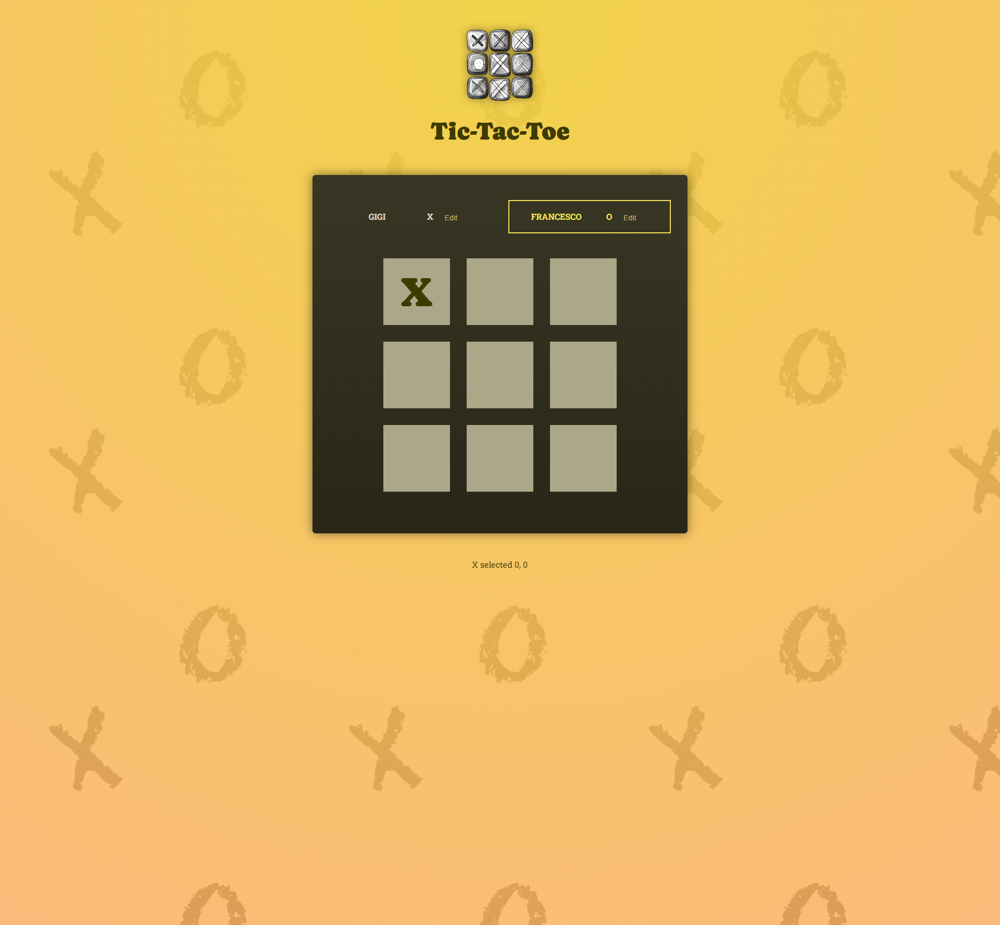
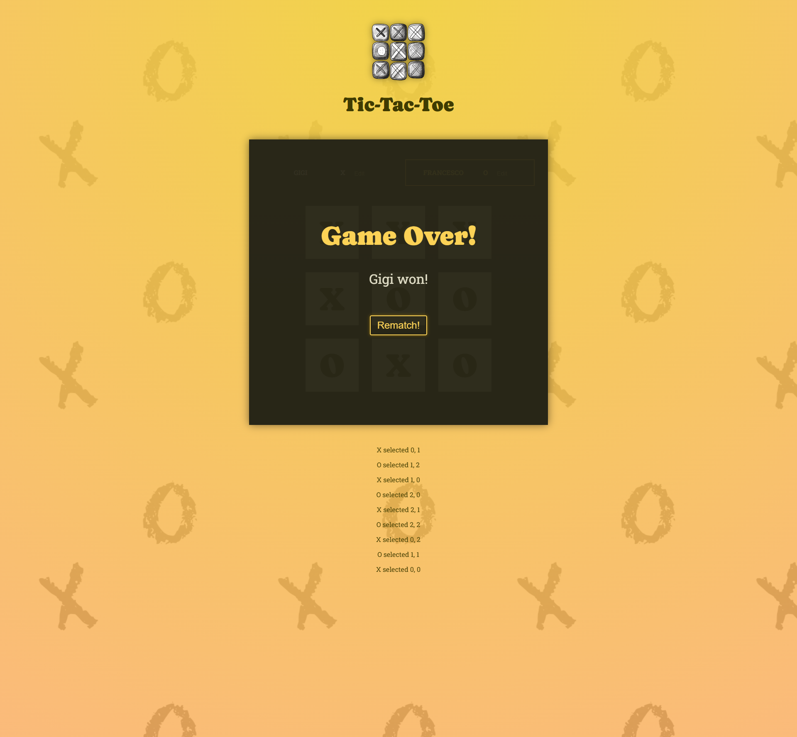

# Tic Tac Toe Project - React Course by Maximilian Schwarzmüller

This is the second project built with React, developed while following the Udemy course React - The Complete Guide 2024 (incl. Next.js, Redux), taught by Maximilian Schwarzmüller.

[Link to Udemy Course](https://www.udemy.com/course/react-the-complete-guide-incl-redux/)

## Project Description

This is a replica of the classic Tic Tac Toe game with additional features to enhance user experience:

- **Player Name Customization:** Each player can set a custom name, which is saved for the game.
- **Move Log:** A real-time log shows each move made, displaying the player's symbol and the selected cell.
- **Game Over Screen:** At the end of the game, a game over screen is displayed with the winner's custom name (or the default name) or a tie announcement.

## Technologies and Libaries Used

- **HTML**: Base page structure
- **CSS**: Styling for the components.
- **JavaScript (ES6+)**: Logic and interactivity.
- **React JS**: Building user interfaces with components.

## Key Concepts Learned

Throughout this project, I consolidated several fundamental React concepts, including:

1. **Component Splitting and Reusability:** Building isolated and reusable components.
2. **State Management:** Working with state and two-way binding for user inputs.
3. **Optimal State Updates:** Using best practices to update state based on the previous state correctly.
4. **Lifting State Up:** Lifting state for sharing across components.
5. **Managing Derived State and Reducing Unnecessary State:** Minimizing state by computing derived values and avoiding unnecessary state management.
6. **Conditional Button Disabling and Immutable State:** Disabling buttons conditionally and ensuring immutable state management.

## Requirements

- **Node.js** (I used the v22.6.0 version)
- **Code Editor** like VS Code

## Installation

1. Clone the repository

```bash
git clone https://github.com/luigitarallo/starting-project-tic-tac-toe.git
```

2. Install dependencies

```bash
npm install
```

3. Run the dev server

```bash
npm run dev
```

The app will be available at `http://localhost:5173/`

## Screenshot




